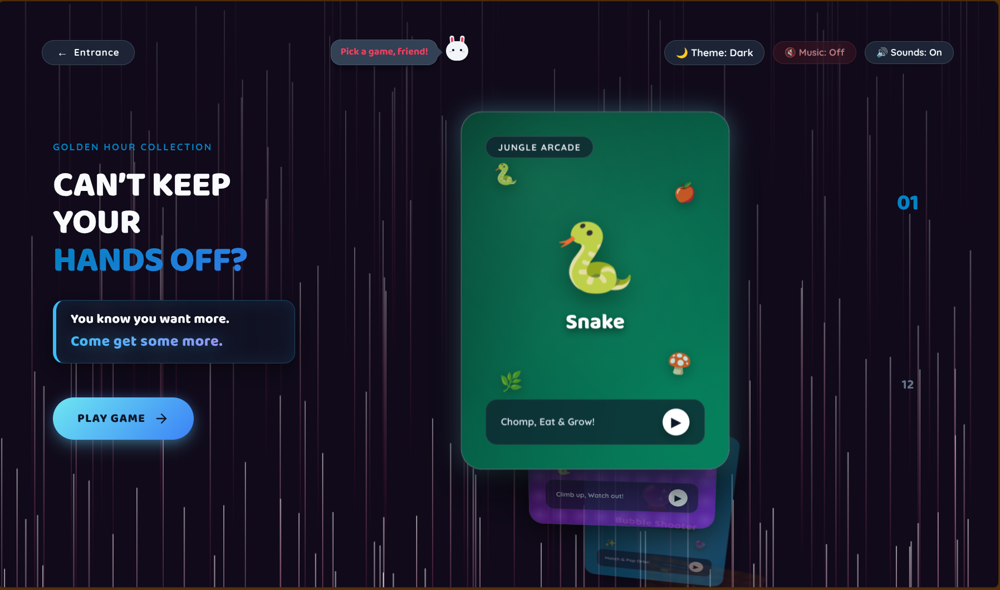
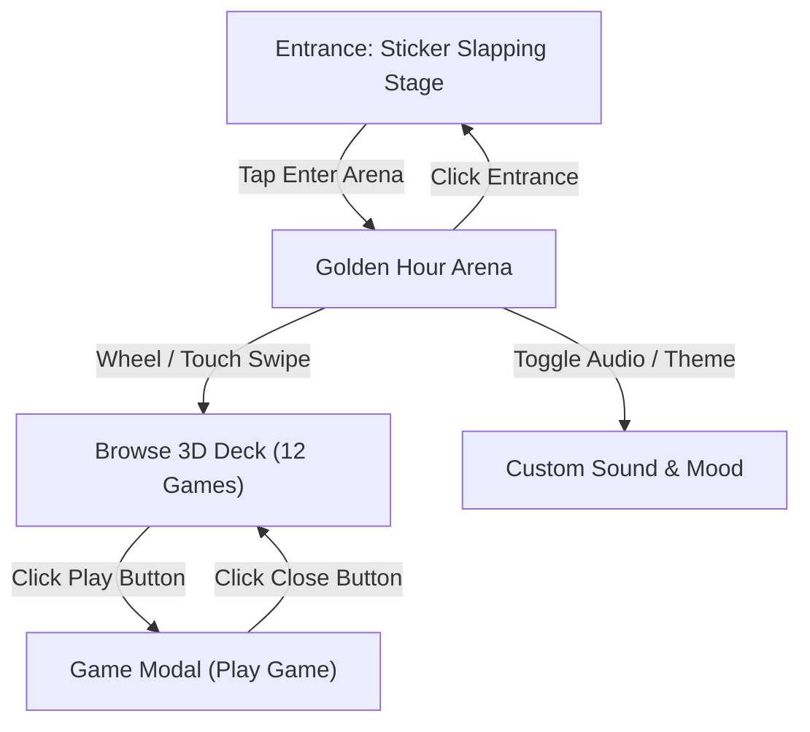
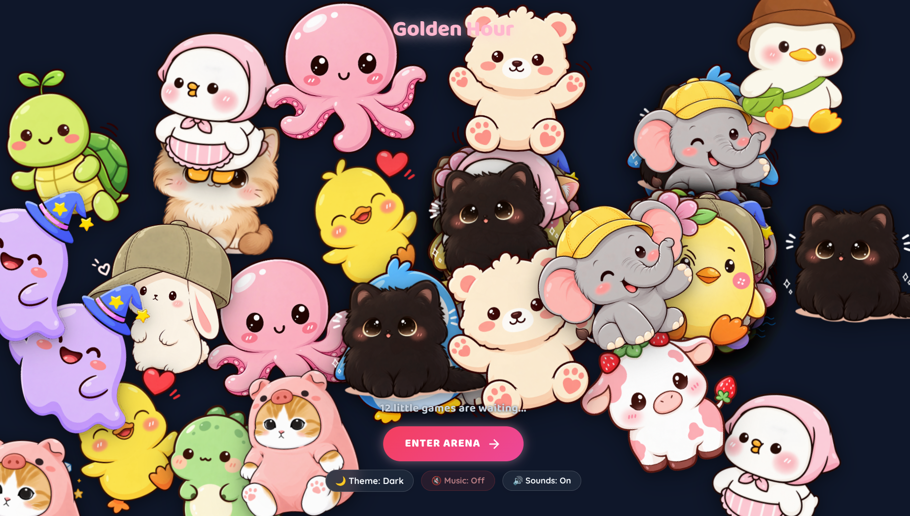

<div align="center">

# GOLDEN HOUR

### *Feeling a little reckless? Go on. Give in.*

[](https://developer.mozilla.org/en-US/docs/Web/HTML)
[](https://developer.mozilla.org/en-US/docs/Web/CSS)
[](https://developer.mozilla.org/en-US/docs/Web/JavaScript)
[](#)

## Welcome to Golden Hour

You clicked, you stumbled in, and now you can't look away. Golden Hour is a private playground built for one thing: keeping your fingers busy.

Slap stickers all over the entrance, slide through a 3D deck of 12 little arcade games, let the pink lasers wash over your screen, and turn up the volume when the retro audio hits just right.

Zero build steps. Zero setup. Just touch and play.

<br/>



---

## How The Addiction Works



---

 
 
---

## The 12 Little Games Waiting For You

Each game sits inside its own physical 3D card deck module:

| Game | Temptation | What It Does To You |
| :--- | :---: | :--- |
| **Snake** | High | Eat, grow, and slide without getting trapped. |
| **Snakes & Ladders** | High | Roll the dice, climb high, and race the CPU to square 100. |
| **Bubble Shooter** | Very High | Aim, pop, and clear the board. |
| **N-Queens Solver** | High | Place queens tactically or watch the solver work its magic. |
| **Minesweeper** | High | Sweep the mines carefully. One bad click and you burst. |
| **Hangman** | High | Crack the secret word before your tries run out. |
| **Sudoku** | Very High | 9x9 grid logic that scratches the itch. |
| **Rock Paper Scissors** | High | Quick hand clash against the machine. |
| **Sliding Puzzle** | High | Slide numbered tiles into perfect order. |
| **2048** | Extreme | Merge matching tiles until you hit the big 2048. |
| **Space Invaders** | Very High | Shoot down invaders and protect your turf. |
| **Memory Match** | High | Flip cards and pair up matching icons. |

---

## Why You'll Stay

- **Sticker Slapper Entrance**: Tap anywhere on the front stage to slap character stickers around the screen.
- **3D Card Deck**: Curved 3D card layout that reacts to your wheel, swipe, or keys.
- **Retro Audio Engine**: Real MP3 background music, custom WAV sound effects, and instant mute toggles.
- **Pink Laser Canvas**: Sweeping laser particles whenever you browse games.
- **All Devices**: Scaled for phones, tablets, and desktop displays.

---

## Directory Setup

```
rock paper sesssior game/
├── charaters/             # 21 sticker assets
├── audio/                 # MP3 music & WAV sound effects
├── games/                 # 12 game modules
├── index.html             # Main entry point & gallery
├── main.js                # Card 3D math & sticker physics
├── style.css              # Glassmorphism & dark/light styles
├── games-audio.js         # Sound manager
└── README.md              # Documentation
```

---

## How to Get Started

1. Open `index.html` directly in your browser, or start a local server:
   ```bash
   python3 -m http.server 8080
   ```
2. Visit `http://localhost:8080` and let Golden Hour take over.

---

<div align="center">

Made for good times.

</div>
